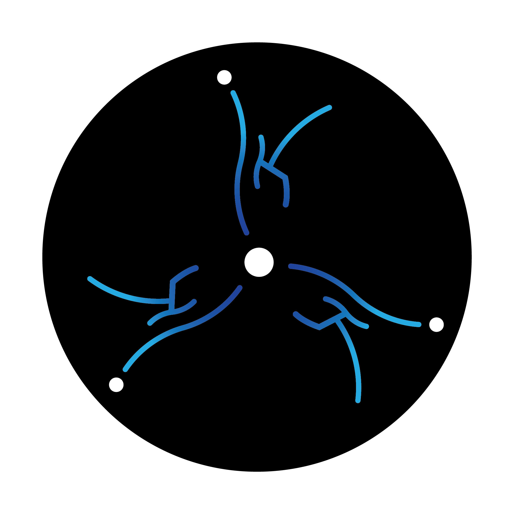

<p align="center"></p>
<h1 align="center">cerebro-backend-2020</h1>

<h4 align="center"> Website for Cerebro 2021 powered by
 and
</h4>

# cerebro-backend-2021

## Development 🔧

## Setup

```sh
$ git clone https://github.com/yashshah2820/cerebro-backend-2021.git
$ cd cerebro-backend-2021
```

### For setting virtual environment

```sh
$ virtualenv venv
```

### For activating virtual environment in Windows

```sh
$ venv/Scripts/activate
```

### For activating virtual environment in Linux and macOS

```sh
$ source venv/bin/activate
```

### For deactivating virtual environment
```sh
$ deactivate
```
After creating virtual environment

### Start

```sh
$ pip install -r requirements.txt
$ python manage.py makemigrations
$ python manage.py migrate
$ python manage.py runserver
```

### Authors :pencil:

©️ [Web Team Cerebro](https://github.com/orgs/cerebro-iiitv/teams/web-team) :tada:
